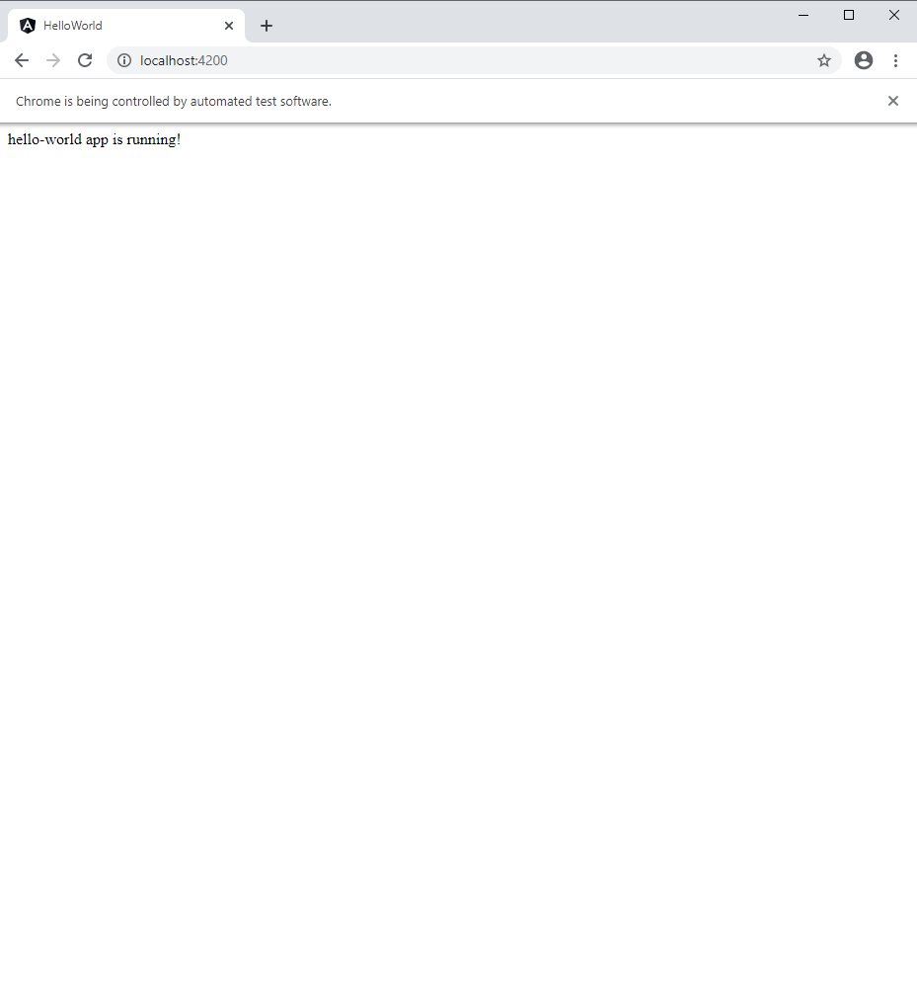

# Introduction

Tutorial Angular using angular-cli

Version used, v10, is the last at this time of creation

# Operations
cd ProjectDir

## Init of project
```
git init
npm init -y
# Install locally angular/cli
npm install @angular/cli
```

## First application, hello-world, generation using angular-cli
npx ng new hello-world

## Check/Use application hello-world generated
Project is created under hello-world directory
```
cd hello-world
npx ng serve
# Open browser at http://localhost:4200 to check it is working...
``` 


# Tests
2 kind of tests :
- e2e, with protractor
- unitary, with karma

As they use different environment for running, they may be launched in parallel without interaction/collision

## Tests E2E
Tests do not use selenium, but are using directly chromeDriver (directConnect=true in protractor.conf.js)

### Using Angular original setup
No debug available
As Angular manages all the process, any current running application must be stopped before launching tests, else a port conflict will occur...

```
# Goto e2e directory
cd hello-world
npm run e2e
```

### Using VScode debug

#### Configuration of launch.json
[Configure launch.json](https://medium.com/@ganeshsirsi/how-to-debug-protractor-tests-in-visual-studio-code-e945fc971a74)
```
{
    "type": "node",
    "request": "launch",
    "name": "E2e Tests",
    "program": "${workspaceFolder}/hello-world/node_modules/protractor/bin/protractor",
    "args": ["${workspaceFolder}/hello-world/e2e/protractor.conf.js"],
    "outFiles": [
    "${workspaceFolder}/hello-world/e2e/../out-tsc/e2e"
    ]
},
```

#### Prepare test env
To run tests, application must be started manually before, because the command which launches tests does not make it
```
npm run start
```

#### Launch test with VScode debugger/run
Set breakpoints in source files and Launch debug with F5 (debug mode) / CTRL F5 (run mode)
In debug mode, Breakpoints must stop execution....
A browser in 'automated test software mode' must be launched...



## Unitary Tests
To run unitary tests, 
```
npm run test
```
A brower must be launched after this command is launched (see picture below).

### Debug
- Configuration is done in karma.config.js [Doc](https://karma-runner.github.io/1.0/config/configuration-file.html)
- Debug is available using browser.

In the browser, Go to http://localhost:9876, 
Then, type F12

In the sources tab, select the file to debug, using the path as follow (see picture below):

/top/context/localhost:9876/_karma_webpack_/src/app/app.component.spec.ts

And debug, using breakpoints of the browser debugger.

If modifications are done, in the code of application, tests are relaunched automatically.


